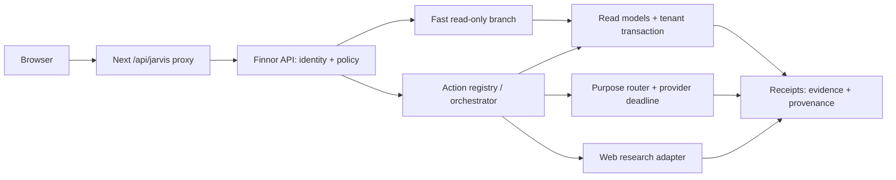

# JARVIS upgrade: integration architecture contract

**Audit date:** 2026-08-04
**Scope:** explicit multi-model routing, fast read-only answers, grounded evidence/citations, and web research/competitor monitoring.
**Change boundary:** architecture/review artifact only. This audit does not implement live-turn cancellation, voice approval, deployment, migration execution, or provider changes.

## Go/no-go

**No-go for broad rollout; go for focused implementation.** Finnor already has the important foundations: bearer-to-tenant identity resolution, `withTenant`/RLS, policy-driven approval, read models, LLM budgets/ledger tables, hybrid retrieval, receipt citations, and an Exa-backed `web_search` tool. The integration contract is not yet met because the main planner and answer plugins can bypass the purpose router and ledger metadata; natural-language read-only questions still enter the full action planner; retrieval confidence can be high merely because a structured fact exists; and web research has no durable, typed citation/monitoring contract or shared end-to-end deadline.

The following contract is the minimum boundary for implementation threads. “Current” below describes observed code, not a certification claim.

## Current wiring and integration gaps

| Priority | Existing foundation | Gap that blocks the contract |
|---|---|---|
| Model routing | `finnor-os/packages/tools/src/llm.ts` has purposes, named providers, health ordering, budgets, and call recording. | `planner.ts` and the overview/customer answer paths still call generic `resolveProvider()` or omit tenant/action/trace metadata. Unknown provider names silently fall back to Groq. |
| Fast read-only answers | `/api/overview`, `/api/read-models/*`, `/api/resources/*`, tenant-scoped caching, and a 5s browser GET / 10s proxy GET boundary exist. | A natural-language business question goes through `POST /api/actions` and the full planner. There is no measured, bounded fast-answer branch. |
| Grounding and citations | `hybridRetrieve`, structured facts, receipt citation extraction, and answer-citation/retrieval tests exist. | Confidence treats any structured fact as high confidence; citation validation is not a server-side claim check; browser instruction traces intentionally do not carry citation truth. |
| Web research | `web-research` actions and the `web_search`/Exa adapter exist, with retry wrapping and policy hooks. | Results are transient `{title,url,snippet}` data, not a durable research receipt; no competitor snapshot/diff/alert schedule exists; Exa has no abort signal of its own. |
| Safety foundations | `requireContext`, `withTenant`, RLS, `canApprove`, effective-dated policies, and atomic run decisions exist. | New research/cache/evidence objects still need the same tenant, approval, retention, and migration guarantees. |

## Executable architecture contract

The implementation is conforming only when the following MUST/ MUST NOT statements are true.

### Identity, tenancy, and approval

1. Every request, provider call, tool call, cache lookup, receipt, research snapshot, and alert resolves the authenticated tenant on the server. A client-supplied tenant ID is a selector at most, never an authority. Database work runs through `withTenant` and RLS; every new durable object has `tenant_id`, appropriate ownership indexes, and RLS tests for tenant A/B.
2. Private proxy paths forward the caller credential only. No service credential is sent to the browser, and tenant integration JSON does not contain raw provider secrets. External integrations resolve secrets after `ensureSecretsLoaded()` at runtime; no secret values are placed in source, tests, docs, logs, fixtures, or receipts.
3. The action registry declares side-effect class, audience, external-call class, approval requirement, timeout budget, and citation requirement. The server enforces those declarations. An internal read-only answer may be ungated only when its execution path proves no write or external mutation. `answer_customer_question` remains customer-facing and gated unless policy explicitly says otherwise. Web reads are non-mutating but remain policy-, budget-, rate-, and audit-controlled.
4. Approval is never inferred from UI state, an LLM response, or an ambiguous voice phrase. Approval decisions are tenant/role checked, atomic, idempotent, and tied to the exact action/run version. A cancellation does not claim to undo an already accepted external effect.

### Explicit model routing and cost provenance

5. All model calls use a typed purpose (`planning`, `critic`, `repair`, `classification`, or `answer`) and an allow-listed named route. The default route map is configuration/policy, but must be explicit and testable: planning may use the planning route; critic/repair the fast route; classification a low-latency route; answers the answer route. A policy override may select only a registered route. Unknown routes fail closed with a typed configuration error; they do not silently select a different provider.
6. Planner, domain plugins, repair/critic paths, and future read-only synthesis call the purpose router rather than a generic provider resolver. Every call carries `tenantId`, `actionId`, `traceId`, purpose, deadline, and urgency. The ledger records provider, model, token usage/cost, latency, and outcome for every billable call, including direct answer paths and deferred calls. Tests must prove the selected provider/model, not just a successful answer.
7. A single request deadline is propagated through composite providers, retries, tools, and the database. Provider/tool abort must stop work where supported; retries are bounded by remaining time and budget. The existing 5s browser GET and 10s proxy GET are hard outer boundaries. The proposed fast-path target is deterministic p95 ≤2s and synthesized read-only p95 ≤4s, with an explicit degraded/refusal response before the outer timeout. These are acceptance targets, not current measurements.

### Fast read-only answers

8. Known internal read-only questions are classified before the expensive planner and routed to a bounded read path using read models or whitelisted read actions. The path MUST NOT execute a write, approval-required action, or unbounded web call. If synthesis is needed, it uses one bounded `answer` call over already retrieved facts; it does not re-run planning.
9. The response envelope contains `traceId`, `actionId`, `answer`/spoken summary, `asOf`, freshness or source timestamps, confidence, and server-derived citations. Tenant- and permission-scoped caches include freshness keys and never serve another tenant or role. A timeout returns a truthful degraded/refusal envelope, not a fabricated current answer.

### Grounded evidence and citations

10. Structured facts are eligible evidence only when relevant to the question and sufficient for the claimed fields. Confidence is based on relevance/coverage and retrieval quality, not on the mere presence of a structured row. Low-confidence answers refuse or state the missing evidence. Corrections may take precedence only when their scope and timestamp match the question.
11. The server constructs citations from retrieved records and web results. The model may word an answer but may not invent citation refs, timestamps, URLs, or source names. Every material factual claim has at least one supporting source; a capability/limit response may have zero citations only when it makes no factual business claim. Receipts preserve evidence/provenance; browser traces are presentation and are not the source of truth. Raw provider errors are not user-facing evidence.
12. Citation refs are stable enough to audit, tenant-scoped, and timestamped. Web citations additionally carry canonical URL, provider/source ID, retrieved-at time, publication time when available, and content hash or equivalent snapshot identity. “Current” or competitor claims always expose retrieval time.

### Web research and competitor monitoring

13. Manual research returns a typed `ResearchRun` linked to tenant/action/trace, provider, sanitized query, retrieved-at time, deadline, and result records (`url`, title, snippet/content excerpt, publication time when available, source ID, and content hash). The research receipt is the citation authority; an LLM cannot turn uncited web text into a business fact.
14. Query construction minimizes and redacts personal/customer data before leaving the system. Provider calls use runtime secrets, a hard abortable timeout, bounded result count, tenant rate/cost limits, and auditable failure/degraded states. No raw provider response or secret is copied into logs or prompts beyond the approved fields.
15. Competitor monitoring is a separate durable workflow, not an implication of a one-off search: tenant-owned targets and cadence, idempotent run key, snapshot retention, canonicalization, diff classification, alert policy, and citation-backed notification. It must be safe to retry and must not report a stale snapshot as live market truth.

### Migrations and operational boundaries

16. Any new table/index/enum or receipt field ships with an ordered migration, migration bundle update, RLS/force-RLS policy, generated types/OpenAPI updates where applicable, indexes, rollback/forward-compatibility notes, fixtures, and tenant-isolation tests. Migration execution is performed by the normal migration job; no production migration is part of this task. The existing instruction-lifecycle prerequisite and the dirty `0063` migration require release-owner coordination.
17. Provider/model configuration is resolved after runtime secret loading. Import-time model constants and stale environment documentation must not override managed runtime configuration. Configuration must identify route names and safe non-secret defaults only; API keys and tokens remain environment/secret-manager inputs.

## Acceptance-test matrix

The matrix is an implementation gate. Existing tests are evidence of a foundation, not proof that the full row is complete. Commands below are focused examples; no live provider call or deployment is required.

| ID | Acceptance scenario | Required evidence / focused test | Audit status |
|---|---|---|---|
| A1 | Tenant A cannot read, cache, cite, or monitor tenant B data. | Extend `finnor-os/tests/integration/tenant-isolation.test.ts` to receipts/research/cache; assert RLS and forged tenant IDs fail. | Foundation; new surfaces unproven |
| A2 | Purpose route is deterministic and allow-listed. | Add `finnor-os/tests/unit/llm-router.test.ts`; assert each purpose, policy override, unknown route failure, and recorded provider/model. | Partial; router exists, coverage missing |
| A3 | Planner and answer plugins use the same router and ledger context. | Add integration coverage for `planner.ts`, `domain-plugins/ops-overview`, and `customer-comm`; assert `purpose`, tenant/action/trace, provider/model, cost, and no generic bypass. | Gap observed |
| A4 | Budget cap defers non-urgent calls with an auditable receipt. | `npm --prefix finnor-os test -- --run tests/integration/cost-governor.test.ts`; retain existing provider-token and hard-cap assertions. | Foundation; rerun in implementation |
| A5 | Known read-only overview/answer avoids the full planner and stays within budget. | Add route/architecture test around `/api/overview` and the new classifier; assert no write/approval/external call and measure deterministic p95 ≤2s / synthesis p95 ≤4s. | Partial; direct overview exists, NL fast branch absent |
| A6 | Fast read response is tenant/permission-scoped and truthful on timeout. | Add API tests for `src/app/api/jarvis/[...path]/route.ts` plus server timeout cases; assert degraded envelope before the 5s client/10s proxy boundary. | Partial; outer proxy budgets exist |
| A7 | Retrieval refuses unrelated structured facts. | Extend `finnor-os/tests/integration/hybrid-retrieval.test.ts` and retrieval evals with unrelated/empty structured rows; assert confidence and refusal are low. | Gap observed; current test permits false high confidence |
| A8 | Answer citations are server-derived and present in the receipt. | `npm --prefix finnor-os test -- --run tests/integration/answer-citations.test.ts`; add claim-to-source validation and assert browser trace is not treated as evidence. | Foundation; validation depth missing |
| A9 | Web research returns durable, timestamped, citation-ready results. | Add mocked Exa tests for `packages/domain-plugins/web-research` and `packages/tools/src/exa.ts`; assert typed results, canonical URL, retrieved-at, publication time, content hash, redaction, and no secret logging. | Gap observed |
| A10 | Competitor monitoring is idempotent and tenant-scoped. | Add worker integration test for target/cadence/run key/snapshot diff/alert retry and stale-data labeling. | Gap; workflow not present |
| A11 | Approval boundary matches action audience and side effects. | Extend `finnor-os/tests/integration/rbac-approval.test.ts` and run-control tests; assert read-only internal answers skip approval only when declared, customer answers stay gated, and decisions are atomic. | Foundation; new answer/research paths unproven |
| A12 | Deadline/cancellation is end-to-end. | Add fake slow provider/tool tests; assert one total deadline, abort signal, no retry after expiry, and terminal timeout/cancel receipt. | Gap; wrappers race without reliably aborting underlying work |
| A13 | Schema changes are release-safe. | CI checks migration ordering/bundle/RLS/types/OpenAPI/fixtures; run `npm --prefix finnor-os run typecheck` and migration verification against an isolated database. | Partial; existing migration process/documentation exists |
| A14 | Secrets are runtime-only and configuration loads after secret hydration. | Unit-test `ensureSecretsLoaded`/provider construction with injected env names and redacted logs; assert production plaintext refusal and no secret literals in tracked files. | Partial; runtime loader exists; import-time model constants remain |
| A15 | Live turn cancellation has a durable boundary. | Follow-on test: session/instruction ownership, abort propagation, durable terminal event, race with approval/external effect, and explicit “not undone” semantics. | Deferred; not implemented here |
| A16 | Voice approval is exact, authenticated, and single-use. | Follow-on test: verified voice identity/tenant, exact pending action/version, role check, ambiguity refusal, atomic idempotent decision; never “latest pending” heuristics. | Deferred; not implemented here |

## Integration risk register

| Risk | Severity | Required owner action |
|---|---|---|
| Generic provider bypass in planner and answer plugins loses purpose routing, budgets, and call provenance. | High | Centralize all calls on the purpose router; add A2/A3 before enabling new models. |
| Tenant isolation may be correct for current tables but absent from new caches, research snapshots, alerts, and evidence. | High | Make tenant/RLS/index/test changes atomic with every schema feature; add A1. |
| “Read-only” labels can hide customer-facing or external-call policy boundaries. | High | Encode audience, side-effect, approval, and external-call metadata in the registry and enforce server-side; add A11. |
| Client/proxy/DB/provider deadlines are already tight; sequential provider fallback and non-aborting wrapper timeouts can outlive the request. | High | Propagate one deadline and `AbortSignal`; impose a total composite budget; add A6/A12. |
| Retrieval can overstate confidence from unrelated structured facts; uncited web output can become answer text. | High | Enforce relevance/coverage and server-derived citation validation; add A7–A9. |
| Competitor monitoring is not a durable workflow yet, so “monitoring” would be a manual search with no diff/alert truth. | High | Design the tenant-owned snapshot/diff workflow and add A10 before promising monitoring. |
| Migration drift or ordering can break realtime/readiness; the dirty `0063` and the documented `0062` prerequisite need release coordination. | High | Keep migration, bundle, RLS, generated artifacts, and tests in one change; run isolated preflight only. |
| Managed secrets can be defeated by import-time model constants or undocumented route envs; tenant config could become a secret sink. | High | Resolve config after secret loading, update non-secret env docs, forbid raw credentials in JSONB/logs, and add A14. |
| Browser instruction traces intentionally omit grounded payload/citations. | Medium | Treat receipts/API evidence as authoritative and label trace data as display-only. |

## Recommended implementation order

1. Close A2–A3: one purpose router, explicit route allowlist, provider/model ledger provenance, and budget propagation.
2. Add A5–A6: classify the fast read-only branch, define the response envelope, cache scope, and total deadline.
3. Close A7–A8: relevance/coverage confidence and server-side citation validation.
4. Build A9–A10: typed research receipts first, then durable competitor snapshots/diffs/alerts.
5. Finish A1, A11–A14 as release gates with migration and secret hygiene. Keep A15–A16 as lower-priority follow-ons; do not imply they are implemented by this contract.

## Review notes

This file intentionally records gaps and acceptance evidence without modifying active implementation work. It treats the existing dirty tree as in-progress work, does not certify the current release, and does not prescribe a provider secret, token, or production migration. The most important go/no-go condition is provenance: a successful answer is insufficient unless the system can prove which tenant, action, purpose, provider/model, evidence, and deadline produced it.
